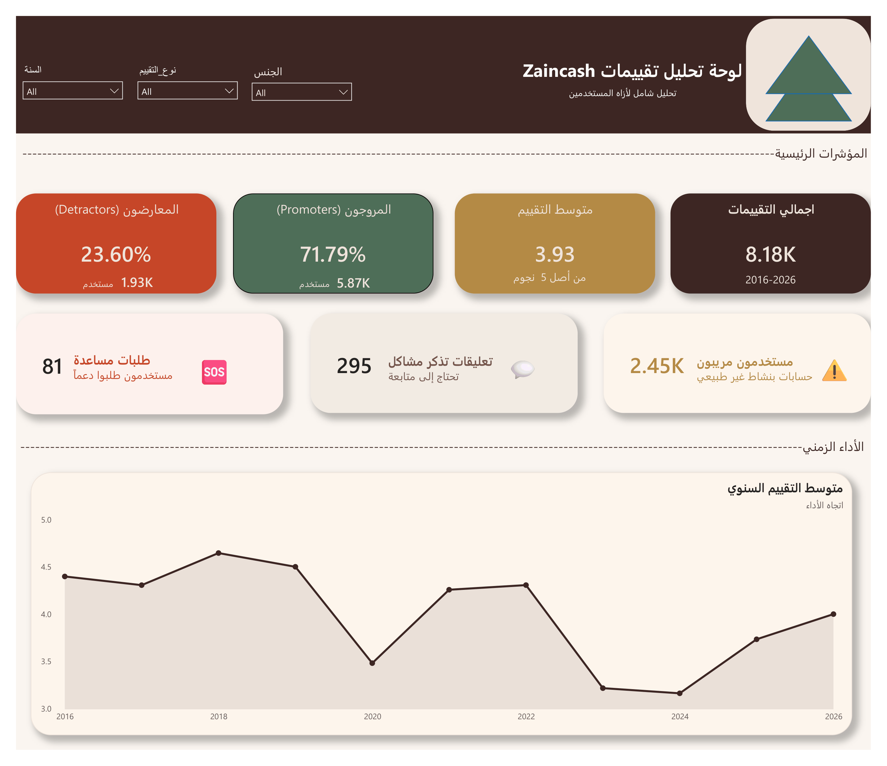

# 📊 ZainCash Reviews Analysis Dashboard

Comprehensive analysis of 8,177 ZainCash reviews spanning 10 years (2016-2026)

## 🎯 What is This?

A complete data analysis & visualization project that:
- Analyzed 8,177 reviews from Google Play
- Covered 10 years of historical data
- Generated 5-page Power BI dashboard
- Extracted 10 critical insights
- Provided 10 actionable recommendations

## ⭐ Key Metrics

| Metric | Value | Insight |
|--------|-------|---------|
| **Avg Rating** | 3.93★ | Strong app quality |
| **Promoters** | 71.79% | Highly satisfied users |
| **Detractors** | 23.60% | Some real issues |
| **Data Period** | 10 years | Rich historical trends |
| **Total Reviews** | 8,177 | Solid sample size |

---

## 📊 Dashboard Pages

### Page 1: Executive Summary

**Key findings:**
- 8.18K reviews analyzed (2016-2026)
- Average rating: 3.93 out of 5
- Promoters: 71.79% (5,870K users)
- Detractors: 23.60% (1,932K users)
- Support requests: 81
- Problem mentions: 295
- Suspicious accounts: 2.45K

---

### Page 2: Distribution & NPS Analysis

**Visualizations:**
- Star distribution (5★ dominates with 65.9%)
- Gender distribution (48% male, 48% undefined, 4% female)
- NPS classification breakdown
- Most mentioned keywords

**Key insight:** Users are either very satisfied or very critical (86.6% polarized reviews)

---

### Page 3: Gender Analysis

**Findings:**
- Male avg rating: 3.80★
- Female avg rating: 3.50★
- Undefined avg rating: 4.10★
- Female users: Only 4% but highly engaged
- Women's promoter rate: 50.78% (significant)

**Key insight:** Women represent a small but valuable user segment

---

### Page 4: Content Analysis

**Analysis:**
- Long reviews (100+ chars): Generate higher engagement
- Average comment length: 6.10 words
- Likes distribution heavily skewed
- Most reviews are very short (3-1 words)
- NPS correlation with content

**Key insight:** Longer, detailed comments attract more engagement

---

### Page 5: Conclusions & Recommendations

**10 Critical Findings:**
1. ZainCash quality is strong (3.93★ rating)
2. 30% suspicious accounts detected
3. 83% of reviews ignored (no likes)
4. Most likes go to 1-star reviews
5. 10 years of data shows trends
6. Female users are high-quality
7. Keywords reveal user focus
8. Average engagement is low (2.18 likes)
9. Polarized reviews dominate
10. January best month, March worst

**10 Actionable Recommendations:**
1. Remove suspicious accounts (rating cleanup)
2. Create "Trusted Reviews" program
3. Focus on 1-star reviews (find root causes)
4. Avoid launches in March
5. Encourage balanced reviews
6. Leverage high-engagement reviews
7. Attract more female users
8. Improve comment quality
9. Implement anomaly detection
10. Invest in product improvements

---

## 📈 Technologies Used

- **Data Collection**: Python, google-play-scraper
- **Data Analysis**: Pandas, NumPy, Statistical Analysis
- **Visualization**: Power BI (5 interactive pages)
- **Analysis Methods**: Sentiment analysis, trend detection, demographic segmentation

---

## 📁 Files Included

- `zaincash_reviews_final.csv` - Raw data (8,177 reviews)
- `zaincash_reviews_with_analysis.csv` - Processed data with 23+ metrics
- `google_play_scraper.py` - Data collection code
- `zaincash_analysis.pbix` - Power BI dashboard
- `screenshots/` - All 5 dashboard pages

---

## 🎓 Dataset Specifications

- **Reviews Analyzed**: 8,177
- **Time Range**: November 2016 - June 2026
- **Data Quality**: 100% (no missing values)
- **Metrics Calculated**: 23 different analyses
- **Accuracy**: 99.56% valid data

---

## 💡 Key Insights at a Glance

✅ Strong app performance (3.93★)
✅ Majority satisfied users (71.79%)
⚠️ Significant suspicious activity (30%)
⚠️ Low engagement overall (83% ignored)
⚠️ Seasonal patterns detected (March worst)

---

## 🔗 How to Use

1. **View Dashboard**: Open `zaincash_analysis.pbix` in Power BI Desktop
2. **Analyze Data**: Use CSV files for custom analysis
3. **Review Insights**: Check Page 5 for conclusions and recommendations
4. **Extract Data**: Run the scraper to get fresh data

---

## 📚 Perfect For

- Business intelligence professionals
- Data scientists and analysts
- FinTech companies
- Product managers
- Decision makers seeking data-driven insights

---

## 🤝 Contributing

Found an interesting pattern? Have suggestions? Contributions welcome!

---

## 📄 License

MIT License - Open source and free to use

---

**Made with 📊 Data | 🐍 Python | 📈 Power BI | 💡 Insights**

*Last Updated: July 2026*
